# Python Syntax Highlighter Report

**Author:** Josue Gomez Artaga A01787212
**Course:** TC2037 Implementation of Computational Methods
**Target language:** Python
**Development language:** Elixir


## 1. Token recognition process

The highlighter works as a **deterministic finite automaton (DFA)** that
scans the input file one character at a time. There is a single top-level
state, called the **dispatcher**, which looks at the current character and
decides which token is starting. Based on that character, control moves to
one of several **sub-automata**, each one responsible for recognizing a
single token type until it reaches an accepting state and returns control
back to the dispatcher.

This is the same idea as a single big DFA, just organized so that each
group of states (the ones that recognize one token type) is written as
its own recursive function. The dispatcher is `classify_char/1` followed
by the `cond` inside `tokenize/2`, and each sub-automaton is one of the
`read_*` functions:

- `read_comment/2` — recognizes comments (`# ...` until end of line)
- `read_string/2`, `read_simple_string/3`, `read_triple_string/3` — recognize
  string literals, including triple-quoted strings and escape sequences
- `read_identifier/2` — recognizes names (letters, digits, underscores)
- `read_number/2` — recognizes integers, floats, scientific notation, hex,
  binary, octal, underscores as digit separators, and complex suffixes
- `read_decorator/1` — recognizes `@name` and `@module.name`
- `read_operator/1` — recognizes operators, matching 3 characters first,
  then 2, then falling back to 1
- `read_whitespace/2` — recognizes runs of spaces and tabs

Once a sub-automaton finishes, `classify_word/2` (for identifiers) decides
the final token type by checking, in order: is it a Python keyword? a
builtin function? a special constant like `self` or `None`? Then it looks
at **the previous token** to decide if the current word is a function name
(comes right after `def`) or a class name (comes right after `class`).
If neither applies, the word's spelling is checked: all uppercase letters
means a module-level constant (`MAX_SIZE`), starting with an uppercase
letter means a class name used elsewhere in the code (`MyClass(x)`), and
everything else is a regular identifier (a variable).

This keeps the recognition rules in one place (`classify_word/2`) instead
of scattering them across the dispatcher, while the character-by-character
scanning itself stays a straightforward DFA.

## 2. State diagram

The diagram below shows the dispatcher state (`START`) and the sub-automata
it transitions into. Each sub-automaton box represents several internal
states of its own (for example, the string reader has separate states for
"inside a normal string" and "inside a triple-quoted string", with a
dedicated state for handling a backslash escape).

```mermaid
stateDiagram-v2
    [*] --> START

    START --> COMMENT : "#"
    START --> STRING : '"' or "'"
    START --> IDENTIFIER : letter or "_"
    START --> NUMBER : digit
    START --> NUMBER : "." followed by digit
    START --> DECORATOR : "@"
    START --> OPERATOR : + - * / % = < > ! & | ^ ~
    START --> PUNCTUATION : ( ) [ ] { } , : ; .
    START --> WHITESPACE : space or tab
    START --> NEWLINE : "\n"
    START --> OTHER : anything else

    COMMENT --> COMMENT : any char except "\n"
    COMMENT --> START : "\n" (token emitted)

    STRING --> STRING : any char (escaped or not)
    STRING --> START : matching quote (token emitted)
    STRING --> START : "\n" with no closing quote (error, emits OTHER)

    IDENTIFIER --> IDENTIFIER : letter, digit or "_"
    IDENTIFIER --> CLASSIFY : any other char
    CLASSIFY --> START : token emitted as keyword / builtin /\nconstant / function_name / class_name /\nconstant_name / identifier

    NUMBER --> NUMBER : digit, ".", "_", "e/E" with sign,\nhex digits after 0x, j/J suffix
    NUMBER --> START : any other char (token emitted)

    DECORATOR --> DECORATOR : "." then identifier
    DECORATOR --> START : token emitted

    OPERATOR --> START : 1, 2 or 3 char match (token emitted)

    PUNCTUATION --> START : single char (token emitted)

    WHITESPACE --> WHITESPACE : space or tab
    WHITESPACE --> START : any other char (token emitted)

    NEWLINE --> START : token emitted

    OTHER --> START : token emitted
```



Within `STRING`, two extra states distinguish a normal quote (`'` or `"`)
from a triple quote (`'''` or `"""`), and a third state is entered after
reading a backslash so the escaped character is consumed without ending
the string. Within `NUMBER`, the transitions include extra checks so that
`.` is only accepted once, `e`/`E` may be followed by a sign, and `0x`/`0b`/
`0o` prefixes unlock hex digits or binary/octal digits.

## 3. Regular expressions for each category

```
keyword       ::= one of the words in the keyword set
identifier    ::= [a-zA-Z_] [a-zA-Z0-9_]*
function_name ::= identifier appearing right after "def"
class_name    ::= identifier appearing right after "class",
                  or any identifier starting with an uppercase letter
constant_name ::= identifier consisting only of uppercase letters,
                  digits and underscores
integer       ::= [0-9] [0-9_]*
float         ::= integer "." [0-9_]* | "." [0-9] [0-9_]*
scientific    ::= (integer | float) [eE] [+-]? [0-9]+
hex           ::= "0" [xX] [0-9a-fA-F_]+
binary        ::= "0" [bB] [01_]+
octal         ::= "0" [oO] [0-7_]+
complex       ::= (integer | float | scientific) [jJ]
string        ::= '"' (char | "\\" char)* '"'  |  "'" (char | "\\" char)* "'"
triple_str    ::= '"""' .* '"""'  |  "'''" .* "'''"
comment       ::= "#" [^\n]*
decorator     ::= "@" identifier ("." identifier)?
operator      ::= one of: + - * / % ** // = == != < > <= >= += -= *= /=
                  %= **= //= & | ^ ~ << >> &= |= ^= <<= >>= -> :=
punctuation   ::= one of: ( ) [ ] { } , : ; .
```

## 4. How to run

The highlighter is a single Elixir module with no external dependencies.

```bash
iex python_highlighter_2.ex
```

```elixir
iex(1)> PythonHighlighter2.highlight("sample.py")
"sample.html"

iex(2)> PythonHighlighter2.highlight_par("sample.py")
"sample.html"

iex(3)> PythonHighlighter2.benchmark("sample.py", 5)
```

`highlight/1` (an alias for `highlight_seq/1`) reads the Python file,
tokenizes it character by character in a single pass, wraps each token
in an HTML `<span>` with its CSS class, and writes the result to a
`.html` file. `highlight_par/1` produces the same output by splitting
the file into chunks and tokenizing them concurrently (see section 6).
A `style.css` is also written next to the output if it doesn't already
exist. `benchmark/2` measures and compares both versions on the same
file (see section 7).

## 5. Algorithm and complexity

### Approach

The processing pipeline is:

```elixir
filename
|> File.stream!()
|> Enum.join("")
|> String.graphemes()
|> tokenize([])
|> Enum.map(&wrap_token/1)
|> Enum.join("")
```

Each character is read exactly once by the dispatcher. When a sub-automaton
takes over (for example `read_number/2`), it consumes a run of characters
that all belong to the same token, so overall every character is visited
a constant number of times (once by the dispatcher, once by the
sub-automaton that claims it). Tokens are accumulated in a list in reverse
order and reversed at the end, which avoids the O(n²) cost of repeatedly
appending to a list in Elixir.

### Time complexity

Let **n** = number of characters in the input file, **t** = number of
tokens produced. Since every token is at least one character, **t ≤ n**.

| Phase | Cost |
|---|---|
| File read + join | **O(n)** |
| Grapheme split | **O(n)** |
| Tokenization (dispatcher + sub-automata) | **O(n)** |
| Word classification (`classify_word/2`) | **O(t · k) = O(n)**, k is a fixed constant |
| List reversal | **O(t) = O(n)** |
| HTML wrapping + join | **O(n)** |
| File write | **O(n)** |
| **Total** | **O(n)** |

The check for `all_uppercase?/1` and `starts_with_uppercase?/1` added for
class/constant/function names runs in O(length of the word), and since
the sum of all word lengths is bounded by n, this does not change the
overall O(n) bound.

### Space complexity

The token list and the HTML output are both proportional to the input
size, so space complexity is also **O(n)**.

### Empirical check

The highlighter was tested on a generated Python file of about 1860 lines
(roughly 49 KB). It produced a 395 KB HTML file with around 9700 tokens
in well under a second, which is consistent with the linear bound above.

## 6. Splitting a single file into chunks

`highlight_par/1` parallelizes the tokenization of **one file** by
splitting its lines into one chunk per core. The dispatcher-based DFA
from section 1 starts every chunk from the `START` state, so each
chunk must begin and end in a state where no token is left "open" -
otherwise a token would be cut in half at the chunk boundary.

Looking at the state diagram, almost every sub-automaton (`COMMENT`,
`NUMBER`, `IDENTIFIER`, `OPERATOR`, ...) finishes before the end of its
line, so a line boundary is always safe. The **only exception** is
`STRING` when it is a triple-quoted string (`\"\"\"...\"\"\"` or `'''...'''`),
which can span many lines.

To handle this, `split_lines_safely/2`:

1. Scans every line with `flips_triple_string?/1`, which counts how
   many `\"\"\"` or `'''` delimiters appear in that line. An odd count
   means the line flips whether we are "inside" a triple-quoted string.
2. Tracks this "inside a triple string" flag while walking through the
   lines, accumulating lines into the current chunk.
3. Only closes a chunk (starts a new one) on a line where the flag is
   `false`, that is, a line where we are not in the middle of a
   triple-quoted string.

This guarantees that every chunk, on its own, starts in the `START`
state and ends with no token left open, so `tokenize_chunk/1` (which
reuses the same dispatcher from section 1) can process each chunk
completely independently.

### Joining the chunks back together

Each chunk is tokenized into its own list of `{type, text}` tuples.
`String.split(content, "\n")` removes the newline between lines, so
after tokenizing, a `{:newline, "\n"}` token is re-inserted between
consecutive chunks with `Enum.intersperse/2` before flattening the
lists. The result is **token-for-token identical** to tokenizing the
whole file in one pass: `highlight_seq/1` and `highlight_par/1`
produce byte-identical HTML output, which was checked on the 2500+
line `big_sample.py` as well as on edge cases (single-line files,
files without a trailing newline, and files with many consecutive
triple-quoted strings).

## 7. Parallel processing and speedup

### Parallelization strategy

```elixir
lines = filename |> File.read!() |> String.split("\n")
chunks = split_lines_safely(lines, System.schedulers_online())

token_lists = chunks
  |> Task.async_stream(&tokenize_chunk/1, max_concurrency: System.schedulers_online())
  |> Enum.map(fn {:ok, tokens} -> tokens end)
```

Each chunk is independent once split, which makes this an
**embarrassingly parallel** problem at the chunk level, even though the
DFA inside each chunk is still single-threaded. `Task.async_stream/3`
spawns one process per chunk and never runs more of them at the same
time than `System.schedulers_online()`, matching the number of cores
on the machine. There is no shared mutable state between chunks: each
one produces its own list of tokens, and the lists are only combined
after every task has finished.

### Measurements

`benchmark/2` runs `highlight_seq/1` and `highlight_par/1` `runs` times
each (default 5) on the same file and reports the average wall-clock
time and the speedup `Sp = T1 / Tp`.

Measured run on `big_sample.py` (2544 lines, about 75 KB), on a
32-core machine, averaging 5 runs of each version:

| Version | Average time | Notes |
|---|---|---|
| Sequential (`highlight_seq/1`) | 63.4 ms | single DFA pass over the whole file |
| Parallel (`highlight_par/1`) | 31.0 ms | file split into 32 chunks |
| Speedup | 2.05x | far below the 32 cores available |

The result is discussed in detail in the next subsection: a 75 KB file
is too small for the fixed overhead of `Task.async_stream/3` and the
sequential split/join steps to be negligible, so the speedup stays
close to 2x instead of approaching 32x.

### Comparison with the single-pass complexity analysis

Section 5 showed that tokenizing a file of size n takes O(n) time in a
single pass. Splitting the file into p chunks of roughly n/p characters
each does not change the total amount of work, it is still O(n)
character inspections in total, but it changes how that work is
scheduled:

```
T1 = O(n)            -- one DFA pass over all n characters
Tp = O(n / p) + O(p) -- p DFA passes over n/p characters each, running
                         concurrently, plus the cost of splitting and
                         joining p chunks
Sp = T1 / Tp ~= p    -- when n is large enough that O(n/p) dominates O(p)
```

In practice Sp stays below p for two reasons: `split_lines_safely/2`
and the final `Enum.intersperse/2` plus `List.flatten/1` are themselves
O(n) sequential steps that run before and after the parallel section,
and `Task.async_stream/3` has a fixed per-task overhead. For a small
file, this fixed overhead can be comparable to the time saved by
parallelizing, so the speedup stays well below p. For a much larger
file, the O(n/p) term would dominate and Sp would approach p.

### Why the measured speedup is 2.05x and not closer to 32x

The measurement above (63.4 ms sequential vs 31.0 ms parallel, on 32
cores) gives Sp = 2.05x. This is consistent with the formula
`Tp = O(n/p) + O(p)`: at 75 KB, `n` is small enough that the `O(p)`
term, the cost of spawning 32 tasks, splitting the file into 32 chunks,
and re-joining 32 token lists, is comparable in size to the `O(n/p)`
term, the actual tokenization work per chunk. Splitting a 63 ms job
into 32 pieces gives each chunk under 2 ms of real work, while starting
and coordinating 32 processes has its own fixed cost on that order.
Once the fixed overhead and the parallel work become comparable, adding
more cores stops helping much, which is exactly Amdahl's law: the
non-parallelizable part of the program (here, the splitting and joining
steps, which are O(n) but run sequentially) puts a ceiling on the
speedup regardless of how many cores are available.

This also matches the trend from the earlier parallel programming
exercises: problems where the per-chunk work is large compared to the
coordination cost (like summing primes over a huge range) reached
speedups close to the number of cores, while problems with small or
cheap per-chunk work saw much smaller speedups. Tokenizing 75 KB of
Python is on the cheap side, so a modest 2x speedup is the expected
result, not a sign of a bug. A multi-megabyte file would be expected to
show a speedup much closer to 32x, since the O(n/p) term would then
dominate the fixed O(p) overhead.

## 8. Reflection on ethical implications

Syntax highlighters look like simple tools but there are a few things
worth thinking about from an ethical perspective.

**Accessibility.** Highlighting that only uses color is a problem for
people with color blindness, which affects roughly 8% of men. This
project uses color combined with bold and italic styles so that token
types can still be told apart even without color. This should be a
minimum requirement for any tool that displays code.

**Trust and security.** A highlighting tool could be misused to make
code look different from what it actually does — for example, coloring
a dangerous function call to look like a comment. People who copy code
from websites should be aware that the visual style might not match
what actually ends up in the clipboard. Pasting into a plain text editor
first is a good habit.

**Tooling bias.** Well-known languages like Python or JavaScript have
great tools, while less popular languages often have very little support.
This creates a cycle where languages with better tooling stay popular.
As developers, choosing to contribute tools for underrepresented
languages is a small way to push back against that.

**Automation and impact.** The same DFA ideas behind this project are
what power compilers, linters, and AI coding assistants. Each layer up
automates more of what developers do. It's worth thinking about what
that means for the people doing that work, not just about how to build
the tools correctly.
